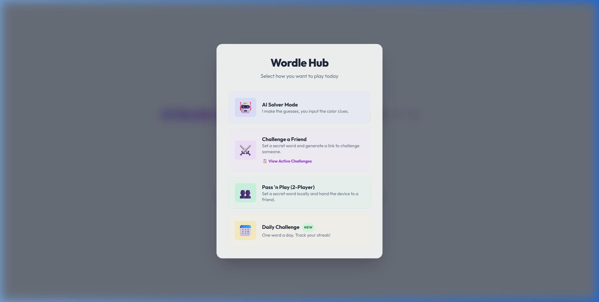
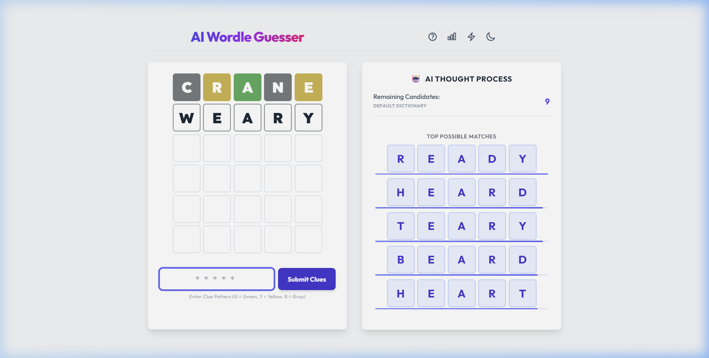
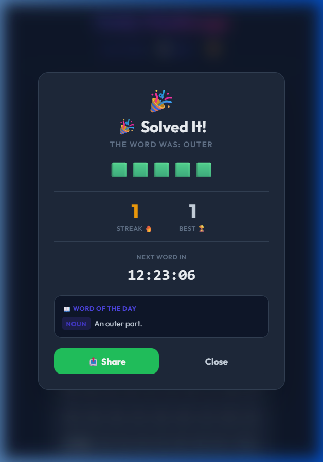

# 🤖 AI Wordle Guesser & Solver

A sophisticated, highly interactive Wordle companion and gameplay platform. Featuring an intelligent AI solver, multiple game modes, statistics tracking, and a premium modern interface with system-wide dark mode support.


---

## 📖 Table of Contents

- [✨ Key Features](#-key-features)
- [🎮 Game Modes](#-game-modes)
- [🧠 The AI Solver Algorithm](#-the-ai-solver-algorithm)
- [📊 Persistence & Stats Tracking](#-persistence--stats-tracking)
- [🛠️ Technologies Used](#️-technologies-used)
- [🚀 Local Setup & Installation](#-local-setup--installation)
- [🌐 Hosting & Deployment](#-hosting--deployment)
- [📄 License](#-license)

---

## ✨ Key Features

- **Side-by-Side UI Layout:** Real-time feedback dashboard splitting the main Wordle board and the active AI engine panel side-by-side on desktop displays.
- **AI Thought Process & Confidence Bars:** Visualizes the AI's search space reduction. Each suggestion displays a gradient confidence meter reflecting entropy calculations.
- **Interactive Feedback System:** Easily submit clues to the AI using standard color patterns (`G` for Green, `Y` for Yellow, and `B` for Gray).
- **System-Wide Dark Mode:** Fully immersive slate dark mode theme, automatically persistent using `localStorage`.
- **Game-Over Modal Overlays:** Backdrop-blurred, springy modal overlay announcing win/loss states, streak metrics, and inline dictionary definitions.
- **Word Definitions on Demand:** Click any historical word on the board to query the dictionary API and display definitions inline.
- **Shareable Results:** Instantly copy game-ending results as shareable emoji grids.

| Light Mode Dashboard | Dark Mode Dashboard |
| :---: | :---: |
|  |  |

---

## 🎮 Game Modes

### 🤖 AI Solver Mode
Set a secret word in your mind, then guide the AI to guess it by inputting the color feedback. Select between **Normal** and **Hard** difficulty levels inside the mode details modal.

- **Normal Mode:** AI guesses any word that maximizes entropy (clue information gain).
- **Hard Mode:** AI is restricted to only guessing words that comply with all previously discovered yellow/green letter rules.

### 📅 Daily Challenge
Play the official word of the day (updated daily at midnight local time) with persistent win-streak tracking and guess distribution histograms.

### ⚔️ Challenge Mode
Generate an encrypted custom URL containing a secret 5-letter word to challenge a friend!

### 👥 Pass 'n Play
Classic two-player mode where Player 1 sets the word and Player 2 tries to solve it on the same device.

| Mode Onboarding & Difficulty | Daily Statistics Histograms |
| :---: | :---: |
|  |  |

---

## 🧠 The AI Solver Algorithm

The engine solves Wordle by selecting the word $w$ from the candidate dictionary $D$ that maximizes the expected information gain (entropy). 

### 1. Clue Patterns
For any guess, there are $3^5 = 243$ possible clue patterns (colors) that could be returned.

### 2. Entropy Calculation
The entropy $H(w)$ of a guess $w$ is defined as:
$$H(w) = - \sum_{i=1}^{243} P(C_i) \log_2 P(C_i)$$
where $P(C_i)$ is the probability of receiving clue pattern $C_i$ if the secret word is randomly selected from the remaining candidates. A higher entropy means the guess is expected to eliminate a larger portion of the candidate list.

### 3. Search Space & Confidence Bars
The interface shows the **AI Thought Process** listing the top suggestions. The **Confidence Bar** represents the information reduction strength of a suggestion, scaling with the remaining candidate count:



---

## 📊 Persistence & Stats Tracking

The game uses `localStorage` to save stats, streaks, and user preferences locally:

- **Theme Preferences:** Persists `wordle_dark_mode` (true/false) to prevent flash-of-light-theme on load.
- **Daily Stats Schema:** Saves `wordle_daily_global_stats` tracking:
  - `played`: Total daily games completed.
  - `won`: Total daily games won.
  - `streak`: Current daily challenge win streak.
  - `maxStreak`: Maximum daily challenge streak achieved.
  - `guesses`: Guess count distribution array `[1st, 2nd, 3rd, 4th, 5th, 6th]`.
- **Inline Dictionary Definitions:** On daily challenge completion, the app fetches definitions from the Free Dictionary API and renders them automatically on the win/loss modal overlay:



---

## 🛠️ Technologies Used

- **Frontend:** HTML5, CSS3, JavaScript (ES6+), Tailwind CSS
- **Audio Processing:** [Tone.js](https://tonejs.github.io/) for synthesised UI audio feedback.
- **Icons & Theme:** Fully customized SVG outline iconography.
- **API Integration:** [Free Dictionary API](https://dictionaryapi.dev/) for real-time word lookup.

---

## 🚀 Local Setup & Installation

To run this project on your local machine:

1. Clone or download the repository files:
   ```bash
   git clone https://github.com/aarabahmad/Wordle-Guesser-AI.git
   cd Wordle-Guesser-AI
   ```
2. Launch a local web server (e.g., using Python, Node.js, or VS Code Live Server):
   - **Node.js:** `npx serve .`
   - **Python:** `python -m http.server 8000`
3. Open your browser and navigate to the local address (e.g., `http://localhost:8000`).

---

## 🌐 Hosting & Deployment

Since this application compiles into static client-side files, you can deploy it for free:

### Vercel CLI
```bash
npx vercel
```
Follow the interactive CLI prompts to deploy to Vercel instantly.

### GitHub Pages
1. Go to **Settings** -> **Pages** in your GitHub repository.
2. Under **Build and deployment**, set the source to **Deploy from a branch**.
3. Choose the `master` or `main` branch and click **Save**.

---

## 🏆 Shared Competitive Leaderboards (Supabase Setup)

By default, Challenge Mode leaderboards store and fetch scores locally on the user's device using `localStorage`. If you want to enable global, cross-device multiplayer leaderboards where users can compete online:

### 1. Create a Supabase Project
1. Go to [Supabase](https://supabase.com/) and sign up for a free account.
2. Click **New Project** and configure your project name, password, and region.

### 2. Create the Database Table
Run the following SQL query in the **SQL Editor** of your Supabase dashboard to create the `wordle_leaderboard` table:

```sql
create table wordle_leaderboard (
  id bigint generated always as identity primary key,
  challenge_id text not null,
  challenge_word text not null,
  player_name text not null,
  guesses integer not null,
  time_seconds integer not null,
  won boolean not null,
  created_at timestamp with time zone default timezone('utc'::text, now()) not null
);

-- Enable Row Level Security (RLS)
alter table wordle_leaderboard enable row level security;

-- Create a policy allowing anyone to read scores
create policy "Allow public read access"
on wordle_leaderboard for select
to public
using (true);

-- Create a policy allowing anyone to submit a score
create policy "Allow public insert access"
on wordle_leaderboard for insert
to public
with check (true);
```

### 3. Connect to the Wordle Application
1. Copy your project's API credentials from your Supabase dashboard under **Settings** -> **API**.
   - **Project URL** (under Project API keys)
   - **anon/public API key**
2. Open `script.js` and update the `supabaseConfig` constant near the top:
   ```javascript
   const supabaseConfig = {
       url: 'https://your-project.supabase.co',
       anonKey: 'your-anon-public-key'
   };
   ```

---

## 📄 License

Distributed under the MIT License. See `LICENSE` for more information.
