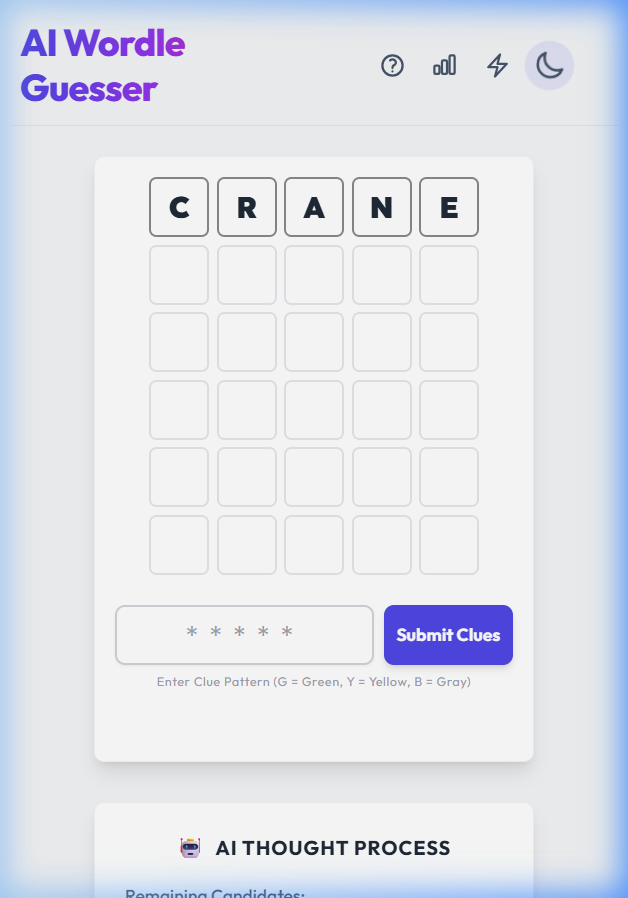
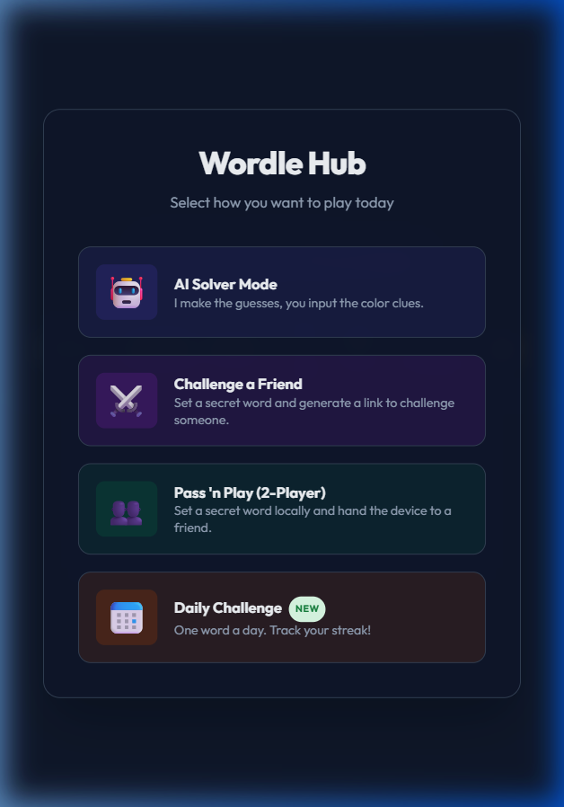
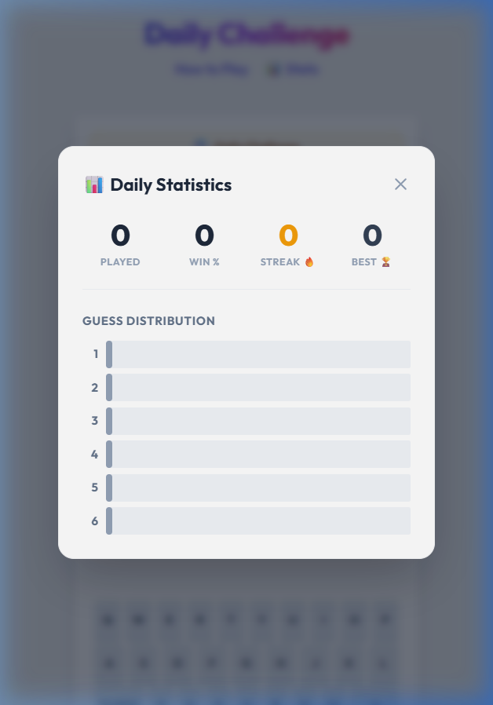
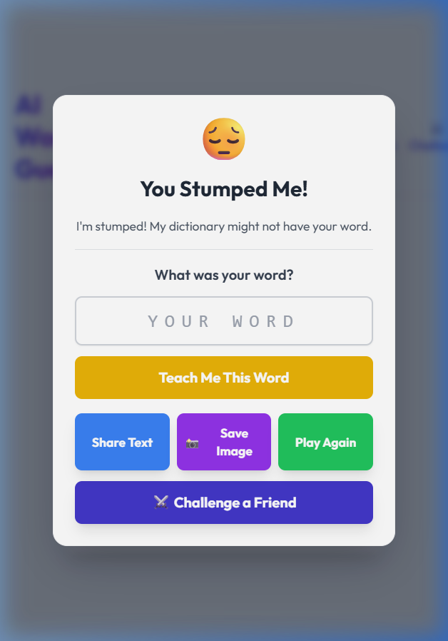

# 🤖 AI Wordle Guesser & Solver

A sophisticated, highly interactive Wordle companion and gameplay platform. Featuring an intelligent AI solver, multiple game modes, statistics tracking, and a premium modern interface with system-wide dark mode support.



---

## 📖 Table of Contents

- [✨ Key Features](#-key-features)
- [🎮 Game Modes](#-game-modes)
- [🛠️ Technologies Used](#️-technologies-used)
- [🚀 Local Setup & Installation](#-local-setup--installation)
- [🌐 Hosting & Deployment](#-hosting--deployment)
- [🤝 How to Contribute](#-how-to-contribute)
- [📄 License](#-license)

---

## ✨ Key Features

- **Side-by-Side UI Layout:** Real-time feedback dashboard splitting the main Wordle board and the active AI engine panel side-by-side on desktop displays.
- **AI Thought Process & Confidence Bars:** Visualizes the AI's search space reduction. Each suggestion displays a gradient confidence meter reflecting entropy calculations.
- **Interactive Feedback System:** Easily submit clues to the AI using standard color patterns (`G` for Green, `Y` for Yellow, and `B` for Gray).
- **System-Wide Dark Mode:** Fully immersive slate dark mode theme, automatically persistent using `localStorage`.
- **Game-Over Modal Overlays:** Backdrop-blurred, springy modal overlay announcing win/loss states, streak metrics, and inline dictionary definitions.
- **Word Definitions on Demand:** Click any historical word on the board to query the dictionary API and display definitions inline.
- **Shareable Results:** Instantly copy game-ending results as shareable emoji grids.

| Light Mode Dashboard | Dark Mode Dashboard |
| :---: | :---: |
|  |  |

---

## 🎮 Game Modes

1. **AI Solver Mode:** Set a secret word in your mind, then guide the AI to guess it by inputting the color feedback. Select between **Normal** and **Hard** difficulty levels inside the mode details modal.
2. **Daily Challenge:** Play the word of the day with persistent win-streak tracking and guess distribution histograms.
3. **Challenge Mode:** Generate a encrypted custom link containing a secret 5-letter word to challenge a friend!
4. **Pass 'n Play:** Classic two-player mode where Player 1 sets the word and Player 2 tries to solve it.

| Daily Statistics Modal | Game Over Modal |
| :---: | :---: |
|  |  |

---

## 🛠️ Technologies Used

- **Frontend:** HTML5, CSS3, JavaScript (ES6+), Tailwind CSS
- **Audio Processing:** [Tone.js](https://tonejs.github.io/) for synthesised UI audio feedback.
- **Icons & Theme:** Fully customized SVG outline iconography.
- **API Integration:** [Free Dictionary API](https://dictionaryapi.dev/) for real-time word lookup.

---

## 🚀 Local Setup & Installation

To run this project on your local machine:

1. Clone or download the repository files:
   ```bash
   git clone https://github.com/aarabahmad/Wordle-Guesser-AI.git
   cd Wordle-Guesser-AI
   ```
2. Launch a local web server (e.g., using Python, Node.js, or VS Code Live Server):
   - **Node.js:** `npx serve .`
   - **Python:** `python -m http.server 8000`
3. Open your browser and navigate to the local address (e.g., `http://localhost:8000`).

---

## 🌐 Hosting & Deployment

Since this application compiles into static client-side files, you can deploy it for free:

### Vercel CLI
```bash
npx vercel
```
Follow the interactive CLI prompts to deploy to Vercel instantly.

### GitHub Pages
1. Go to **Settings** -> **Pages** in your GitHub repository.
2. Under **Build and deployment**, set the source to **Deploy from a branch**.
3. Choose the `master` or `main` branch and click **Save**.

---

## 📄 License

Distributed under the MIT License. See `LICENSE` for more information.
